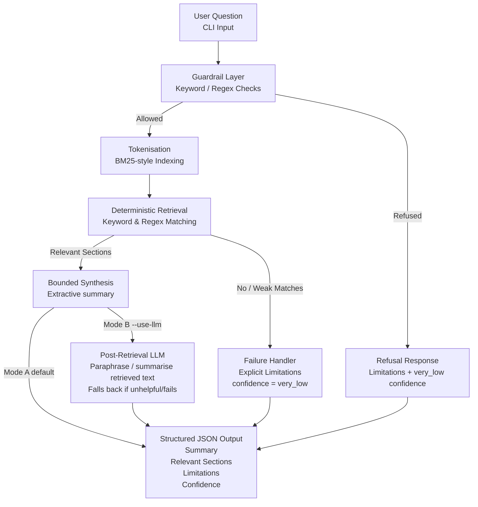

```mermaid
flowchart TD
    Q[User Question<br/>CLI Input]

    Q --> G[Guardrail Layer<br/>Keyword / Regex Checks]
    G -->|Allowed| T[Tokenisation<br/>BM25-style Indexing]
    G -->|Refused| R[Refusal Response<br/>Limitations + very_low confidence]

    T --> M[Deterministic Retrieval<br/>Keyword & Regex Matching]

    M -->|No / Weak Matches| L[Failure Handler<br/>Explicit Limitations<br/>confidence = very_low]
    M -->|Relevant Sections| S[Bounded Synthesis<br/>Extractive summary]

    %% Mode A: deterministic (default)
    S -->|Mode A default| O[Structured JSON Output<br/>Summary<br/>Relevant Sections<br/>Limitations<br/>Confidence]

    %% Mode B: opt-in LLM paraphrase
    S -->|Mode B --use-llm| X[Post-Retrieval LLM<br/>Paraphrase / summarise retrieved text<br/>Falls back if unhelpful/fails]
    X --> O

    L --> O
    R --> O
```

_LLM is opt-in (`--use-llm`); retrieval, guardrails, and refusal remain deterministic. Unhelpful or failed LLM output falls back to the deterministic summary with a limitation note._
